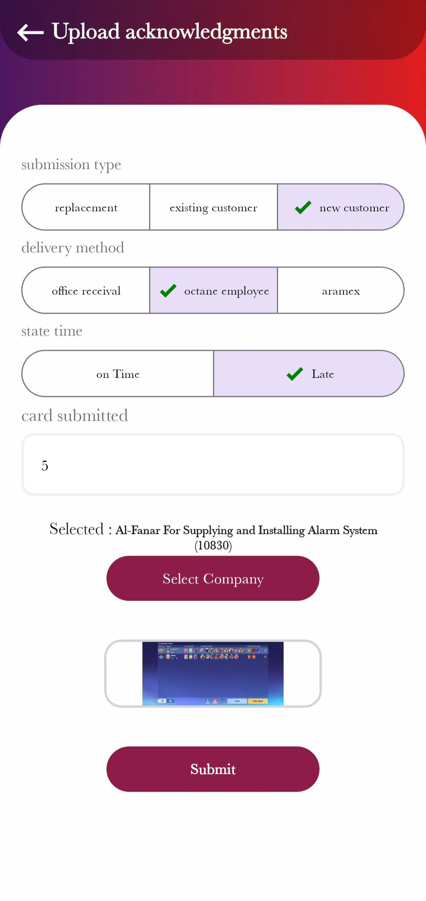

# Octane 🚚⚡

**Octane** is a smart and efficient app for managing **NFC line deliveries** to trucks, featuring an admin dashboard to distribute lines to employees and track delivery status in real-time.

---

## 📝 App Description

Octane is designed for logistics companies, allowing:

- **Employees** to:
  - Log in securely.
  - Deliver **NFC lines** to trucks.
  - Upload documents or images related to the delivery.

- **Admin (Manager)** to:
  - Access a **Dashboard** to track all delivered lines.
  - Assign lines to employees.
  - Monitor performance and delivery status in real-time.

---

## 🎨 User Interface

- Modern and user-friendly design.
- Consistent colors for easy readability and quick interaction.
- Clear icons for each action (upload, login, deliver, assign).

### Example Screenshots:

| Home  | Upload |
|------|--------|
|  |   |

---

## ⚙️ Technologies Used

- **React Native + Expo**: Full-featured mobile application.  
- **Expo Router**: Smooth navigation between screens.  
- **Redux & Redux Toolkit**: State management.  
- **React Query**: Efficient data fetching and API management.  
- **Formik & Yup**: Form handling and validation.  
- **NativeWind (Tailwind)**: Responsive styling and layout.  
- **FlashList**: Optimized lists for large datasets.  
- **Expo Image & Image Picker**: Uploading and viewing images.  
- **React Native Paper & Animatable**: UI components and animations.  
- **Responsive Libraries**: `react-native-responsive-dimensions` & `react-native-responsive-fontsize` for consistent layouts on all screens.

---

